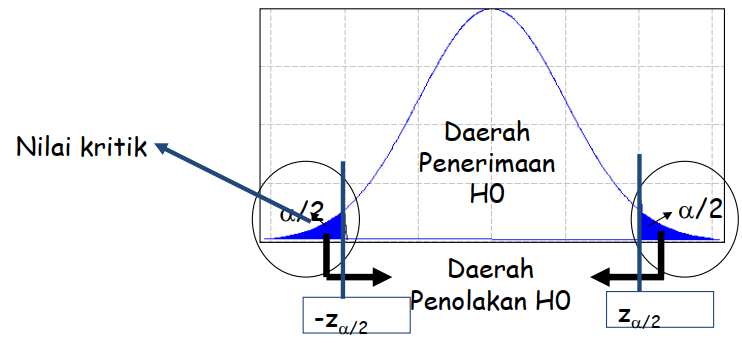
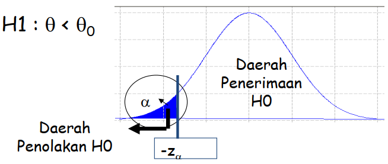
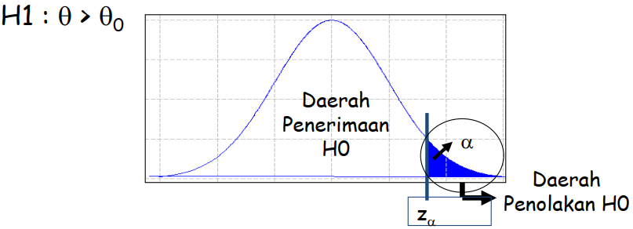
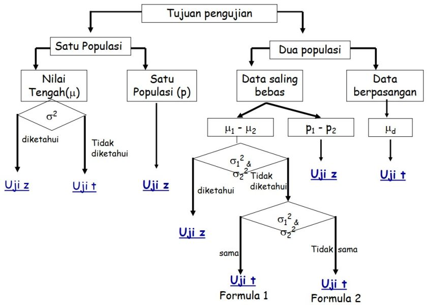
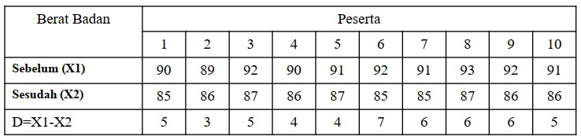
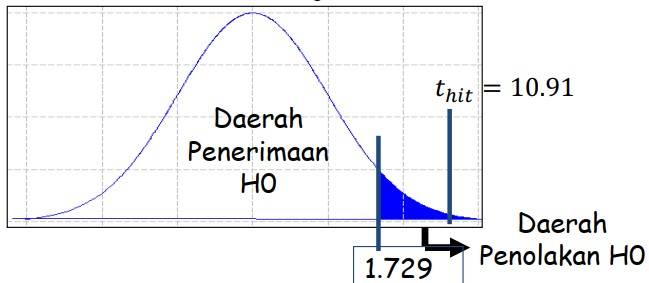
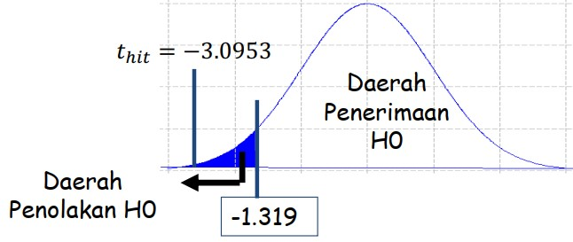
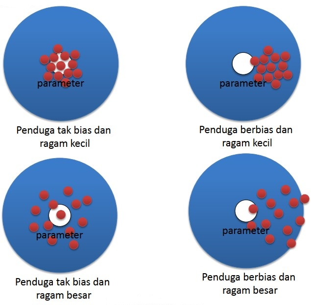
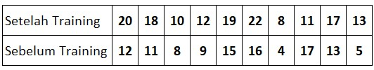

```{r xaringanExtra, echo=FALSE}
xaringanExtra::use_xaringan_extra(c("tile_view", "animate_css", "tachyons"))
```

```{r xaringan-panelset, echo=FALSE}
xaringanExtra::use_panelset()
```

```{r xaringan-scribble, echo=FALSE}
xaringanExtra::use_scribble()
```

```{r xaringan-logo, echo=FALSE}
xaringanExtra::use_logo(
  image_url = "Unsera.png"
)
```

```{r xaringanExtra-webcam, echo=FALSE}
xaringanExtra::use_webcam()
```

```{r xaringanExtra-search, echo=FALSE}
xaringanExtra::use_search(show_icon = TRUE)
```


.pull-left[
<br><br>


]

.pull-right[
<br>
# **.purple[Outline]**

- ##Pendahuluan Uji Hipotesis
- ##Uji Hipotesis untuk Rata-Rata
- ##Uji Hipotesis untuk Proporsi

]

---

.pull.center[

## **Pendahuluan Uji Hipotesis**

]

.pull-left[

- **Pengujian hipotesis** adalah langkah-langkah yang dilakukan dengan tujuan untuk memutuskan apakah suatu hipotesis tersebut diterima atau ditolak

- **Hipotesis** adalah asumsi yang bisa benar atau salah terhadap suatu masalah dan perlu pengujian lebih lanjut

- Ada dua kemungkinan dalam pengujian hipotesis yaitu menolak atau menerima hipotesis. Menolak hipotesis artinya bahwa hipotesis tidak benar. **Menerima hipotesis artinya tidak cukup bukti untuk menolak hipotesis**


]

.pull-right[

- Rumusan pengujian hipotesis, selalu dibuat pernyataan hipotesis dengan harapan akan ditolak, disebut sebagai hipotesis nol, $H_0$.

- Penolakan hipotesis nol akan menjurus pada penerimaan hipotesis alternatif, $H_1$. 

- Dasar yang dipakai untuk merumuskan hipotesis antara lain: 
  1. pengetahuan, 
  1. hasil penelitian, 
  1. pengalaman, dan 
  1. ketajaman berpikir.

]

---

.pull.center[

### **Pendahuluan Uji Hipotesis**

]

.pull-left[

**Hipotesis Statistik** adalah suatu pernyataan tentang parameter populasi

- $H_0$ (Hipotesis Nol) adalah suatu pernyataan yang bersifat "**status quo**" (tidak ada beda, tidak ada perubahan)

- $H_1$ (Hipotesis Alternatif) adalah pernyataan lain yang akan diterima jika $H_0$ ditolak ("ada perbedaan", "terdapat perubahan")

]

.pull-right[

Dalam pengambilan keputusan memungkinkan untuk terjadi kesalahan.

|   | $H_0$ benar | $H_0$ salah |
|:--| :--:        |:--:         |
|Tolak $H_0$ | Peluang salah jenis I (Taraf nyata; $\alpha$ ) | Kuasa Pengujian $(1-\beta)$ |
|Terima $H_0$ | Tingkat Kepercayaan $(1-\alpha)$ | Peluang salah jenis II $(\beta)$

- Memperkecil kesalahan tipe-I $(\alpha)$ akan memperbesar kesalahan tipe-II $(\beta)$ dan sebaliknya.
- Makin besar ukuran sampel, nilai $\alpha$ dan $\beta$ akan makin kecil.


]

---

.pull.center[

### **Pendahuluan Uji Hipotesis**

]

.pull-left[

**Langkah-Langkah Pengujian Hipotesis**

1. Rumuskan Hipotesis Nol $(H_0)$ dan Hipotesis Alternatif $(H_1)$. Uji 1 arah atau uji 2 arah.

1. Tentukan nilai $\alpha$ yang menggambarkan daerah penolakan dan penerimaan $H_0$

1. Tentukan dan hitung Statistik Uji yang sesuai dengan hipotesis

1. Pengujian Hipotesis: Tolak atau terima $(H_0)$

1. Kesimpulan


]

.pull-right[

### 1. Hipotesis
.red[**Hipotesis 2 Arah:**]

$H_0$ : $\theta=\theta_0 \hspace{1cm}$ Vs $\hspace{1cm}H_1$ : $\theta\ne\theta_0$

.red[**Hipotesis 1 Arah:**]

$H_0$ : $\theta \le \theta_0 \hspace{1cm}$ Vs $\hspace{1cm}H_1$ : $\theta>\theta_0$

atau

$H_0$ : $\theta \ge \theta_0 \hspace{1cm}$ Vs $\hspace{1cm}H_1$ : $\theta<\theta_0$


]

---


.pull.center[

### **Pendahuluan Uji Hipotesis**

]

.pull-left[

### 2. Nilai $\alpha$

Nilai $\alpha$ atau tingkat nyata (_significant level_) merupakan peluang melakukan kesalahan jenis-I

### 3. Statistik Uji

Statistik uji yang digunakan harus dengan sesuai dengan sebaran dari hipotesis. Secara umum, bentuk dari statistik uji adalah seperti berikut.

$U=\dfrac{\hat{\theta}}{s_\hat{\theta}}$

$\theta$ merupakan sembarang parameter <br>
$U$ merupakan sembarang statistik uji untuk paramater $\theta$

]

.pull-right[

### 4. Pengujian Hipotesis

Tergantung pada $H_1$. Misalkan $U \sim N(0,1)$ dan <br> $H_1$ : $\theta \ne \theta_0$


Tolak $H_0$ jika $U<-z_\frac{\alpha}{2}$ atau $U>z_\frac{\alpha}{2}$

]
---

.pull.center[

### **Pendahuluan Uji Hipotesis**

]

.pull-left[



Tolak $H_0$ jika $U<-z_{\alpha}$


Tolak $H_0$ jika $U>z_{\alpha}$
]

.pull-right[

### 5. Kesimpulan

Cukup bukti / tidak cukup bukti untuk menolak $H_0$ benar pada taraf nyata $\alpha$
]

---

.pull.center[



]

---

.pull.center[


]

---

class: inverse, center, middle

# Uji Hipotesis Untuk rata-rata $(\mu)$ 1 Populasi

---

.pull-left[
### Hipotesis

Satu arah:
- $H_0$ : $\mu \ge \mu_0 \hspace{1cm}\text{Vs}\hspace{1cm}H_1:\mu<\mu_0$
- $H_0$ : $\mu \le \mu_0 \hspace{1cm}\text{Vs}\hspace{1cm}H_1:\mu>\mu_0$

Dua arah:
- $H_0$ : $\mu = \mu_0 \hspace{1cm}\text{Vs}\hspace{1cm}H_1:\mu \ne \mu_0$

### Statistik Uji

Ragam populasi $(\sigma^2)$ diketahui:
$z_0=\dfrac{\bar{x}-\mu_0}{\sigma/\sqrt{n}}$

Ragam populasi $(\sigma^2)$ tidak diketahui:
$t_0=\dfrac{\bar{x}-\mu_0}{s/\sqrt{n}}$

]

.pull-right[

### Pengujian Hipotesis

**Ragam populasi $(\sigma)$ diketahui:**

- $H_0$ : $\mu \ge \mu_0 \hspace{1cm}\text{Vs}\hspace{1cm}H_1:\mu<\mu_0$

Tolak $H_0$ jika $z_0<-z_\alpha$

- $H_0$ : $\mu \le \mu_0 \hspace{1cm}\text{Vs}\hspace{1cm}H_1:\mu>\mu_0$

Tolak $H_0$ jika $z_0>z_\alpha$

- $H_0$ : $\mu = \mu_0 \hspace{1cm}\text{Vs}\hspace{1cm}H_1:\mu \ne \mu_0$

Tolak $H_0$ jika $z_0<-z_\frac{\alpha}{2}$  atan $z_0>z_\frac{\alpha}{2}$

**Ragam populasi $(\sigma)$ tidak diketahui:**

Ganti $z_0$, $z_\alpha$, dan $z_\frac{\alpha}{2}$ dengan $t_0$, $t_{\alpha:(n-1)}$, dan $t_{\frac{\alpha}{2}:(n-1)}$

]

---

.pull-left[

**Contoh**

Batasan yang ditentukan oleh pemerintah terhadap emisi gas CO kendaraan bermotor adalah 50 ppm. Sebuah perusahaan baru yang sedang mengajukan ijin pemasaran mobil, diperiksa oleh petugas pemerintah untuk menentukan apakah perusahaan tersebut layak diberikan ijin.

Sebanyak 20 mobil diambil secara acak dan diuji emisi CO-nya. Dari data didapatkan, rata-ratanya 55 dan ragamnya 4.2. Dengan menggunakan taraf nyata 5%, layakkah perusahaan tersebut mendapat ijin?

___
Diketahui:<br>
$n=20$, $\bar{x}=55$, dan $s^2=4.2$

$H_0$ : $\mu \le 50 \hspace{1cm}\text{Vs}\hspace{1cm}H_1:\mu > 50$

**Statistik uji**<br>
Karena $\sigma^2$ tidak diketahui maka statistik uji yang digunakan adalah
$$t_0=\dfrac{\bar{x}-\mu_0}{s/\sqrt{n}}$$

]

.pull-right[

$t_0=\dfrac{\bar{x}-\mu_0}{s/\sqrt{n}}=\dfrac{55-50}{\sqrt{4.2}/\sqrt{20}}=10.91$

**Titik Kritis**

Karena merupakan uji satu arah, maka titik kritis yang sesuai dengan statistik uji adalah 

$t_{\alpha(n-1)}=t_{0.05(19)}=1.729$



Terlihat bahwa $t_0>t_{0.05(19)}$ sehingga $H_0$ .red[**ditolak**]. Cukup bukti untuk
menyatakan bahwa perusahaan mobil tersebut tidak layak diberikan izin pada taraf nyata 5%
]

---

.pull-left[

**Latihan 1**

Direktur keuangan suatu perusahaan berpendapat bahwa rata-rata pengeluaran untuk biaya hidup perhari bagi setiap karyawan di perusahaan tersebut adalah Rp176.000,00. Untuk menguji pendapatnya, dilakukanlah wawancara terhadap 25 karyawan secara acak dan didapat rata-rata pengeluaran harian sebesar Rp170.000,00 dengan simpangan baku sebesar Rp10.000,00. Dengan taraf nyata $5\%$, ujilah pendapat tersebut.

___

**Latihan 2**

Ada yang mengatakan bahwa jarak yang ditempuh sebuah mobil secara rata-rata kurang dari 20000 km dalam 1 tahun. Untuk menguji pendapat ini suatu contoh acak 100 pemilik mobil diminta mencatat km yang ditempuhnya. Apakah anda sependapat dengan pernyataan di atas jika contoh tersebut menghasilkan rata-rata 23500 km dengan simpangan baku 3900 km?

]

.pull-right[

**Latihan 3**

Seorang pejabat perbankan yang bertanggung jawab dalam pemberian kredit beranggapan bahwa rata-rata modal perusahaan nasional adalah sebesar Rp100 milyar. Untuk menguji anggapannya tersebut, dipilih secara acak 81 perusahaan nasinal dan didapat rata-rata modal mereka adalah Rp105 milyar dengan simpangan baku Rp18 milyar. Dengan menggunakan $\alpha=1\%$, ujilah anggapan tersebut.
]

---

class: inverse, center, middle

# Uji Hipotesis untuk selisish rata-rata $(\mu_1-\mu_2)$ 2 populasi saling bebas

---

.pull-left[
### Hipotesis

Satu arah:
- $H_0$ : $\mu_1 \ge \mu_2 \hspace{1cm}\text{Vs}\hspace{1cm}H_1:\mu_1<\mu_2$
- $H_0$ : $\mu_1 \le \mu_2 \hspace{1cm}\text{Vs}\hspace{1cm}H_1:\mu_1>\mu_2$

Dua arah:
- $H_0$ : $\mu_1 = \mu_2 \hspace{1cm}\text{Vs}\hspace{1cm}H_1:\mu_1 \ne \mu_2$

### Statistik Uji

**1. Jika $\sigma^2_1$ dan $\sigma^2_2$ diketahui:**
$z_0=\dfrac{\bar{x}_1-\bar{x}_2}{\sqrt{\dfrac{\sigma^2_1}{n_1}+\dfrac{\sigma^2_2}{n_2}}}$

**Titik Kritis:** $z_\alpha$ (.red[uji satu arah]), $z_\frac{\alpha}{2}$ (.red[uji dua arah])

]

.pull-right[

**2. Jika $\sigma^2_1$ dan $\sigma^2_2$ tidak diketahui <br>dan diasumsikan sama:**

$t_0=\dfrac{\bar{x}_1-\bar{x}_2}{\sqrt{s^2_\text{gab}\left( \dfrac{1}{n_1}+\dfrac{1}{n_2}\right)}}$ di mana

$s^2_\text{gab}=\dfrac{(n_1-1)s^2_1+(n_2-1)s^2_2}{n_1+n_2-2}$

**Titik Kritis:** 

.red[uji satu arah] : $t_{\alpha(v)}$ 

.red[uji dua arah] : $t_{\frac{\alpha}{2}(v)}$ 

dengan $v=n_1+n_2-2$

]

---

.pull-left[

**3. Jika $\sigma^2_1$ dan $\sigma^2_2$ tidak diketahui <br>dan diasumsikan tidak sama:**

$t_0=\dfrac{\bar{x}_1-\bar{x}_2}{\sqrt{ \dfrac{s^2_1}{n_1}+\dfrac{s^2_2}{n_2}}}$

**Titik Kritis:** 

.red[uji satu arah] : $t_{\alpha(v)}$ 

.red[uji dua arah] : $t_{\frac{\alpha}{2}(v)}$ 

dengan 
$v=\dfrac{\left(\dfrac{s^2_1}{n_1}+\dfrac{s^2_2}{n_2}\right)^2}{\dfrac{\left(\dfrac{s^2_1}{n_1}\right)^2}{\left(n_1-1\right)}+\dfrac{\left(\dfrac{s^2_2}{n_2}\right)^2}{n_2-1}}$

]

.pull-right[

**Contoh**

Seorang manager jasa pengiriman <br>meyakini bahwa paket-paket yang dikiriman <br>pada akhir bulan lebih berat daripada paket-<br>paket yang dikirimkan pada awal bulan. Untuk menguji keyakinan tersebut seorang peneliti mengambil sampel 15 paket pada awal bulan dan diperolah ratarata 40 kg dan simpangan baku 6 kg, sedangkan sampel 10 paket yg dipilih akhir bulan rata-rata beratnya 50 kg dgn simpangan baku 10,2 kg.

Jika diasumsikan ragam kedua populasi sama, dapatkah kita menyimpulkan bahwa pendapat manager itu benar pada taraf nyata 10% ?

___

Misalkan $1 \rightarrow$ awal, dan $2 \rightarrow$ akhir <br>
**Hipotesis**: $H_0$ : $\mu_1 \ge \mu_2$ dan $H_1$ : $\mu_1<\mu_2$ <br>
**Statistik Uji**:
$t_0=\dfrac{\bar{x}_1-\bar{x}_2}{\sqrt{s^2_\text{gab}\left( \dfrac{1}{n_1}+\dfrac{1}{n_2}\right)}}$

]

---

.pull-left[

$\begin{align*}s^2_\text{gab}&=\dfrac{(n_1-1)s^2_1+(n_2-1)s^2_2}{n_1+n_2-2}\\&=\dfrac{(15-1)6^2+(10-1)10.2^2}{15+10-2} \\&=62.62\end{align*}$

$\begin{align*} t_0&=\dfrac{\bar{x}_1-\bar{x}_2}{\sqrt{s^2_\text{gab}\left( \dfrac{1}{n_1}+\dfrac{1}{n_2}\right)}}\\&=\dfrac{40-50}{\sqrt{62.62\left( \dfrac{1}{15}+\dfrac{1}{10}\right)}}\\&=-3.0953\end{align*}$

**Titik Kritis**: $t_{\alpha(v)}=t_{0.1(23)}=1.319$

$H_0$ .red[**ditolak**] jika $t_0<t_{\alpha(v)}$


]

.pull-right[

Terlihat bahwa $t_0<t_{\alpha(v)}$, <br>
sehingga $H_0$ ditolak
<br><br>


<br><br>
Dengan demikian cukup bukti untuk menyatakan pendapat manager tersebut benar pada taraf nyata $5\%$.

]

---

.pull-left[
**Latihan 1**

Seorang pemilik perusahaan yang membuat bola lampu merek A dan B berpendapat bahwa tidak ada perbedaan rata-rata lamanya daya tahan kedua merek lampu tersebut. Untuk menguji pendapatnya, dilakukan percobaan terhadap 100 lampu merek A dan 50 lampu merek B yang dipilih secara acak. Ternyata rata-rata daya tahan lampu A 952 jam dan merek B 987 jam dengan simpangan baku masing-masing 85 jam dan 92 jam. Dengan $\alpha=5\%$, ujilah pendapat tersebut.
___

**Latihan 2**

Seorang petugas pengawasan mutu rokok di Kementrian Kesehatan berpendapat bahwa tidak ada perbedaan rata-rata kadar nikotin yang terdapat pada rokok merek A dan B. Untuk menguji pendapat tersebut, dipilih sampel acak sebanyak 10 batang rokok merek A dan 8 batang rokok merek B. Dari hasil laboratorium didapat rata-rata nikotin rokok merek A adalah 23.1 mg dengan simpangan baku 1.5 mg. Sedangkan rata-rata nikotin pada rokok merek B adalah 22.7 mg dengan simpangan
]

.pull-right[
<br><br><br>

baku 1.7 mg. Ujilah pendapat tersebut menggunakan taraf nyata $5\%$ dengan asumsi ragam kedua populasi tersebut sama.

]
---

class: inverse, center, middle

# Uji Hipotesis untuk rata-rata selisih 2 populasi <br>tidak saling bebas (data berpasangan)

---

.pull-left[

Uji Hipotesis untuk data berpasangan sering digunakan sebagai dasar evaluasi, misalnya:

1. Apakah rata-rata penjualan salesman yang belum mendapatkan pelatihan $(\mu_1)$ sama atau lebih kecil dari rata-rat penjualan salesman yang sudah mendapatkan pelatihan $(\mu_2)$?

1. Apakah rata-rata pendapatan penduduk suatu desa sebelum listrik PLN masuk $(\mu_1)$ lebih kecil dibandingkan dengan rata-rata pendapatan setelah listrik PLN masuk $(\mu_2)$?

1. Apakah rata-rata berat badan orang-orang sebelum meminum suatu produk diet lebih kecil dibandingkan dengan rata-rata berat badan sesudah meminum produk diet?

]

.pull-right[

### Hipotesis

Misalkan $\mu_1-\mu_2=\mu_D$

Satu arah:
- $H_0$ : $\mu_D \ge \delta_0 \hspace{1cm}\text{Vs}\hspace{1cm}H_1:\mu_D<\delta_0$
- $H_0$ : $\mu_D \le \delta_0 \hspace{1cm}\text{Vs}\hspace{1cm}H_1:\mu_D>\delta_0$

Dua arah:
- $H_0$ : $\mu_D = \delta_0 \hspace{1cm}\text{Vs}\hspace{1cm}H_1:\mu_D \ne \delta_0$

]

---

.pull-left[

### Statistik Uji

| Pasangan Data | 1 | 2 | 3 | ... | $n$ |
|:---           |:--:|:-:|:-:|:-:|:-:|
| Data Awal ( $X_1$ )| $x_{11}$ | $x_{12}$ | $x_{13}$ | ... | $x_{1n}$ |
| Data Akhir ( $X_2$ )| $x_{21}$ | $x_{22}$ | $x_{23}$ | ... | $x_{2n}$ |
|  $d = X_1 - X_2$ | $d_1$ | $d_2$ | $d_3$ | ... | $d_n$ |

.pull.center[
$s^2_d=\dfrac{\sum_{i}(d_i-\bar{d})^2}{n-1}$

$d_i=x_{1i}-x_{2i}$

$\bar{d}=\dfrac{\sum_{i}d_i}{n}$
]

Statistik uji yang digunakan adalah 

$$t_0=\dfrac{\bar{d}-\delta_0}{s_d/\sqrt{n}}$$

]

.pull-right[

**Titik Kritis:**

- Uji satu arah: $t_{\alpha(n-1)}$
- Uji dua arah: $t_{\frac{\alpha}{2}(n-1)}$

### Pengujian Hipotesis

Satu arah:
- $H_0$ : $\mu_D \ge \delta_0 \hspace{1cm}\text{Vs}\hspace{1cm}H_1:\mu_D<\delta_0$ maka $H_0$ .red[**ditolak jika**] $t_0<-t_{\alpha(n-1)}$

- $H_0$ : $\mu_D \le \delta_0 \hspace{1cm}\text{Vs}\hspace{1cm}H_1:\mu_D>\delta_0$ maka $H_0$ .red[**ditolak jika**] $t_0>t_{\alpha(n-1)}$

Dua arah:
- $H_0$ : $\mu_D = \delta_0 \hspace{1cm}\text{Vs}\hspace{1cm}H_1:\mu_D \ne \delta_0$ maka $H_0$ .red[**ditolak jika**] $t_0<-t_{\frac{\alpha}{2}(n-1)}$ .red[**atau**] $t_0>t_{\frac{\alpha}{2}(n-1)}$


]

---

**Contoh**

Suatu klub kesegaran jasmani ingin mengevaluasi program diet, kemudian dipilih secara acak 10 orang anggotanya untuk mengikuti program diet tersebut selama 3 bulan. Data yang diambil adalah berat badan sebelum dan sesudah program diet dilaksanakan, yaitu:


.pull-left[

Apakah program diet tersebut dapat mengurangi berat badan minimal 5 kg? Lakukan pengujian pada taraf nyata 5%!

]

.pull-right[

Karena kasus ini merupakan contoh data berpasangan, maka hipotesis yang digunakan adalah:

$H_0$ : $\mu_D \ge 5 \hspace{1cm}\text{Vs}\hspace{1cm}H_1:\mu_D<5$

]

---

.pull-left[

$\bar{d}=\dfrac{\sum_{i}d_i}{n}=\dfrac{51}{10}=5.1$

$s^2_d=\dfrac{\sum_{i}(d_i-\bar{d})^2}{n-1}=\dfrac{n\sum_{i}d^2_i-(\sum_{i}d_i)^2}{n(n-1)}=1.43$

$s_d=\sqrt{s^2_d}=\sqrt{1.43}=1.2$

**Statistik Uji**:


$t_0=\dfrac{\bar{d}-\delta_0}{s_d/\sqrt{n}}=\dfrac{5.1-5}{1.2/\sqrt{10}}=0.26$

**Titik Kritis**: $t_{\alpha(n-1)}=t_{0.05(9)}=1.833$

**Pengujian Hipotesis** pada taraf nyata 5%: <br> $H_0$ ditolak jika $t_0<-t_{0.05(9)}=-1.833$

**Kesimpulan**:<br>
$H_0$ .red[tidak ditolak], cukup bukti untuk menyatakan program diet tersebut dapat mengurangi berat badan minimal 5 kg pada taraf nyata 5%

]

.pull-right[

**Latihan**

Direktur pemasaran akan melanjutkan program training bagi para salesman jika rata-rata penjualan setelah dilatih lebih tinggi dari sebelum dilatih. Berikut adalah hasil penjualan dari 10 salesman yang dipilih secara acak.


- Ujilah Hipotesis: <br> $H_0$ : $\mu_D \le 0 \hspace{1cm}\text{Vs}\hspace{1cm}H_1:\mu_D>0$ <br>dengan taraf nyata 5%

- Berdasarkan jawaban di atas, apakah program training bagi salesman perlu dilanjutkan? Mengapa?
]

---

class: inverse, center, middle

# Uji Hipotesis untuk proporsi $(p)$ <br>1 populasi

---

.pull-left[

### Hipotesis

.red[**Satu arah**]:
- $H_0$ : $p \ge p_0 \hspace{1cm}\text{Vs}\hspace{1cm}H_1:p < p_0$
- $H_0$ : $p \le p_0 \hspace{1cm}\text{Vs}\hspace{1cm}H_1:p > p_0$

.red[**Dua arah**]:
- $H_0$ : $p = p_0 \hspace{1cm}\text{Vs}\hspace{1cm}H_1:p \ne p_0$

### Statistik Uji

$z_0=\dfrac{\hat{p}-p_0}{\sqrt{\dfrac{p_0(1-p_0)}{n}}}$

**Titik Kritis**:<br>
$z_\alpha$ (satu sisi), $z_\frac{\alpha}{2}$ (dua sisi)

]

.pull-right[

**Contoh**

Menurut suatu artikel suatu obat baru yang diekstrak dari suatu jamur,
cyclosporin A, mampu meningkatkan tingkat kesuksesan dalam operasi
transplantasi organ. Menurut artikel tersebut, 32 pasien yang menjalani
operasi transplantasi ginjal diberikan obat baru tersebut. Dari 32 pasien
tersebut, 19 diantaranya sukses dalam operasi transpalntasi ginjal.
Sebagai informasi bahwa keberhasilan dengan menggunakan prosedur yang
standar adalah sekitar 60%.

Apakah dapat dikatakan bahwa obat baru tersebut lebih baik dari
prosedur yang standar pada taraf nyata 5%?
___

Diketahui $\hat{p}=\dfrac{19}{32}=0.59$

Ditanyakan apakah $p>0.6$?

**Hipotesis**: 

$H_0$ : $p \le 0.6 \hspace{1cm}\text{Vs}\hspace{1cm}H_1:p > 0.6$

]


---

.pull-left[

**Statistik Uji**:

$$z_0=\dfrac{\hat{p}-p_0}{\sqrt{\dfrac{p_0(1-p_0)}{n}}}=\dfrac{0.59-0.6}{\sqrt{\dfrac{0.6(1-0.6)}{32}}}=-0.16$$
**Titik Kritis**: $z_{0.05}=1.96$

**Pengujian Hipotesis** pada taraf nyata 5%.<br>
$H_0$ ditolak jika $z_0>z_{0.05}=1.96$

**Kesimpulan**:<br>
Karena $z_0<1.96$ maka $H_0$ .red[**tidak ditolak**]. Tidak cukup bukti untuk mengatakan bahwa obat baru lebih baik dari prosedur standar pada taraf nyata 5%.

]

.pull-right[

**Latihan 1**

Seorang pejabat sebuah bank berpendapat bahwa peminjam kredit yang belum mengembalikan kreditnya sebesar 70% atau lebih. Untuk menguji pendapatnya, sebanyak 225 orang peminjam kredit dipilih secara acak dan ternyata 150 orang di antaranya belum mengembalikan kredit. Lakukan uji hipotesis terhadap pendapat pejabat bank tersebut pada taraf nyata 5%.

___

**Latihan 2**

Seorang pengusaha ingin mendirikan pasar swalayan di sebuah kota. Dia beranggapan bahwa minimal 70% ibu rumah tangga senang berbelanja di pasar swalayan. Pengusaha tersebut menyewa konsultan untuk menguji pendapatnya tersebut. Sebanyak 600 ibu rumah tangga dipilih secara acak dan ternyata 406 orang di antaranya mengatakan senang berbelanja di pasar swalayan. Dengan menggunakan taraf nyata 5%, ujilah pendapat pengusaha tersebut.

]

---

class: inverse, center, middle

# Uji Hipotesis untuk selisih proporsi $(p_1-p_2)$ <br>2 populasi

---

.pull.center[

### Misalkan selisih antara $p_1$ dan $p_2$ adalah $\delta_0$

]

.pull-left[

### Jika $\delta_0=0$

**Hipotesis**:

Satu arah:
- $H_0$ : $p_1 \ge p_2 \hspace{1cm}\text{Vs}\hspace{1cm}H_1:p_1 < p_2$
- $H_0$ : $p_1 \le p_2 \hspace{1cm}\text{Vs}\hspace{1cm}H_1:p_1 > p_2$

Dua arah:
- $H_0$ : $p_1 = p_2 \hspace{1cm}\text{Vs}\hspace{1cm}H_1:p_1 \ne p_2$

]

.pull-right[

### Jika $\delta_0>0$

**Hipotesis**:

Satu arah:
- $H_0$ : $p_1-p_2 \ge \delta_0 \hspace{1cm}\text{Vs}\hspace{1cm}H_1:p_1-p_2 < \delta_0$
- $H_0$ : $p_1-p_2 \le \delta_0 \hspace{1cm}\text{Vs}\hspace{1cm}H_1:p_1-p_2 > \delta_0$

Dua arah:
- $H_0$ : $p_1-p_2=\delta_0 \hspace{1cm}\text{Vs}\hspace{1cm}H_1:p_1-p_2 \ne \delta_0$

]

---

.pull-left[

### Jika $\delta_0=0$

**Statistik Uji**

$z_0=\dfrac{\hat{p}_1-\hat{p}_2}{\sqrt{\hat{p}(1-\hat{p})\left(\dfrac{1}{n_1}+\dfrac{1}{n_2}\right)}}$

di mana $\hat{p}=\dfrac{x_1+x_2}{n_1+n_2}$

**Titik Kritis**:

Uji satu arah: $z_\alpha$

Uji dua arah: $z_\frac{\alpha}{2}$

]

.pull-right[

### Jika $\delta_0>0$

**Statistik Uji**

$z_0=\dfrac{(\hat{p}_1-\hat{p}_2)-\delta_0}{\sqrt{\dfrac{\hat{p}_1(1-\hat{p}_1)}{n_1}+\dfrac{\hat{p}_2(1-\hat{p}_2)}{n_2}}}$

**Titik Kritis**:

Uji satu arah: $z_\alpha$

Uji dua arah: $z_\frac{\alpha}{2}$

]


---

.pull-left[

**Contoh**

Sebuah penelitian dilakukan untuk menguji pengaruh obat baru untuk viral infection. 100 ekor tikus diberikan suntikan infeksi kemudian dibagi secara acak ke dalam dua grup masing-masing 50 ekor tikus. Grup 1 sebagai kontrol, dan grup 2 diberi obat baru tersebut. Setelah 30 hari, proporsi tikus yang hidup untuk grup 1 adalah 36% dan untuk grup 2 adalah 60%. Apakah obat tersebut efektif pada taraf nyata 5%?

Obat dikatakan efektif jika perbedaan antara grup perlakuan dengan grup kontrol lebih dari 12%.

___

Misalkan:<br>
Group Kontrol $\rightarrow 1$ <br>
Group Perlakuan $\rightarrow 2$

$\hat{p}_1=0.36$ ; $\hat{p}_2=0.6$<br>
$n_1=n_2=50$

Ditanyakan $p_2-p_1>0.12$?


]

.pull-right[

**Hipotesis**

$H_0$ : $p_1-p_2 \le 0.12 \hspace{0.5cm}\text{Vs}\hspace{0.5cm}H_1:p_1-p_2 > 0.12$

**Statistik Uji**

$$\begin{align*}
z_0&=\dfrac{(\hat{p}_2-\hat{p}_1)-\delta_0}{\sqrt{\dfrac{\hat{p}_1(1-\hat{p}_1)}{n_1}+\dfrac{\hat{p}_2(1-\hat{p}_2)}{n_2}}}\\
&=\dfrac{(0.6-0.36)-0.12}{\sqrt{\dfrac{0.36(1-0.36)}{50}+\dfrac{0.6(1-0.6)}{50}}}\\
&=1.24
\end{align*}$$

**Titik Kritis**:<br>
Uji satu arah: $z_{0.05}=1.645$ <br>
$H_0$ ditolak jika $z_0>z_{0.05}$

**Kesimpulan**: Karena $1.24<1.645$, maka $H_0$ tidak ditolak. Belum cukup bukti untuk menunjukkan bahwa obat tersebut efektif.
]


---

.pull-left[

**Latihan 1**

Seorang pejabat dari Dirjen Pajak berpendapat bahwa persentase wajib pajak yang belum membayar pajak dari dua daerah adalah sama. Untuk menguji pendapatnya, telah diteliti sebanyak 200 wajib pajak dari daerah pertama dan ada 7 orang yang belum membayar pajak. Sedangkan dari 400 orang wajib pajak di daerah kedua, terdapat 10 wajib pajak yang belum membayar pajak. Ujilah pendapat tersebut dengan taraf nyata 5%.

___

**Latihan 2**

Seorang direktur mareketing berpendapat bahwa persentase barang yang tidak laku di antara produk A dan B adalah sama. Dari 200 produk A yang dijual di pasar, ada 50 produk yang diretur. Dari 200 produk B, sebanyak 70 produk yang diretur. Dengan menggunakan taraf nyata 10%, ujilah pendapat direktur marketing tersebut.

]

.pull-right[


]

---


class: inverse, center, middle

# Thank you!
# See you next week

