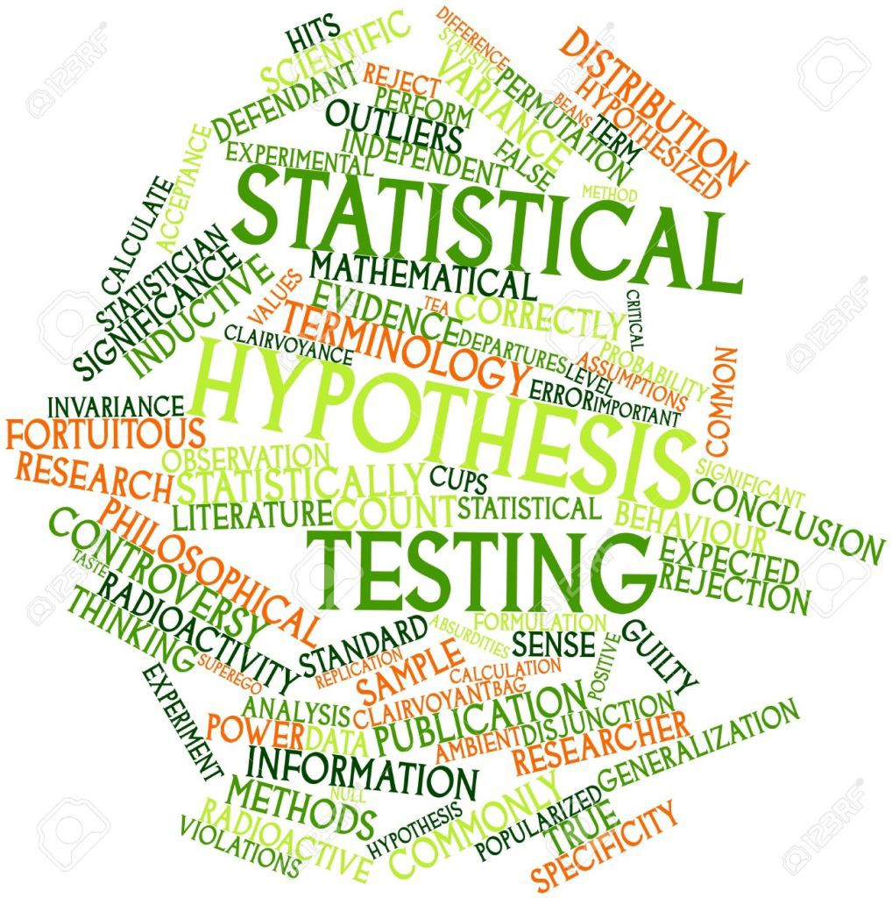

```{r xaringanExtra, echo=FALSE}
xaringanExtra::use_xaringan_extra(c("tile_view", "animate_css", "tachyons"))
```

```{r xaringan-panelset, echo=FALSE}
xaringanExtra::use_panelset()
```

```{r xaringan-scribble, echo=FALSE}
xaringanExtra::use_scribble()
```

```{r xaringan-logo, echo=FALSE}
xaringanExtra::use_logo(
  image_url = "Unsera.png"
)
```

```{r xaringanExtra-webcam, echo=FALSE}
xaringanExtra::use_webcam()
```

```{r xaringanExtra-search, echo=FALSE}
xaringanExtra::use_search(show_icon = TRUE)
```


.pull-left[
<br><br><br><br><br><br><br>


]

.pull-right[
<br>
# **.purple[Outline]**

- ##Interpretasi Selang Kepercayaan
- ##Penduga Selang untuk Proporsi
- ##Penduga Selang untuk Ragam

]

---

.pull.center[

## **Selang Kepercayaan 95%**


]

---

.pull.center[

### **Interpretasi Selang Kepercayaan**

]

.pull-left[

**Slide 13 Pertemuan 08**

Selang Kepercayaan (SK) 95% bagi $\mu$ adalah
$$22.01 < \mu < 22.99$$

**Kesimpulan**: 
1. Kita percaya bahwa pada selang 22.01 sampai 22.99 desiliter .red[**memuat**] rataan banyaknya minuman yang dikeluarkan mesin dengan peluang 95%, .red[**_atau_**]

1. Kita percaya bahwa pada selang 22.01 sampai 22.99 desiliter .red[**tidak memuat**] rataan banyaknya minuman yang dikeluarkan mesin dengan peluang 5%

]

.pull-right[

**Slide 20 Pertemuan 08**

Selang Kepercayaan (SK) 95% bagi $\mu_1-\mu_2$ adalah
$$-1863 < \mu_1-\mu_2 < -1737$$
**Kesimpulan**: 
1. Kita percaya bahwa pada selang $-1863$ sampai $-1737$ jam .red[**memuat**] selisih rataan pemakaian ban dengan peluang 95%, .red[**_atau_**]

1. Kita percaya bahwa pada selang $-1863$ sampai $-1737$ jam .red[**tidak memuat**] selisih rataan pemakaian ban dengan peluang 5%


]

---

.pull.center[

### **Interpretasi Selang Kepercayaan**

]

.pull-left[

**Slide 25 Pertemuan 08**

Selang Kepercayaan 95% bagi rata-rata selisih berat badan sebelum dan sesudah program diet $(\mu_d)$ adalah

$$4.24 < \mu_d < 5.96$$

**Kesimpulan**: 
1. Kita percaya bahwa pada selang $4.24$ sampai $5.96$ kg **memuat** rataan selisih berat badan sebelum dan sesudah program diet dengan peluang 95%, .red[**_atau_**]

1. Kita percaya bahwa pada selang $4.24$ sampai $5.96$ kg **tidak memuat** rataan selisih berat badan sebelum dan sesudah program diet dengan peluang 5%

]

.pull-right[

Pada Selang Kepercayaan untuk selisih rataan dari 2 populasi yang saling bebas:

1. $\text{positif (+)} < \mu_1-\mu_2 <\text{positif (+)}$ <br>
maka rataan populasi 1 .red[**lebih besar**] dari rataan populasi 2
1. $\text{negatif (-)} < \mu_1-\mu_2 <\text{negatif (-)}$ <br>
maka rataan populasi 1 .red[**lebih kecil**] dari rataan populasi 2
1. $\text{negatif (-)} < \mu_1-\mu_2 <\text{positif (+)}$ <br>
maka rataan populasi 1 .red[**tidak berbeda**] dari rataan populasi 2

Hal tersebut berlaku pula pada Selang Kepercayaan pada .red[**data berpasangan**]

]

---

.pull.center[

### **Jenis Penduga Selang**


]

---

class: inverse, center, middle

# Penduga Selang untuk Proporsi $(p)$ 1 Populasi

---

.pull.center[
### $p$ diduga oleh $\hat{p}$


]

---

.pull.center[
### Dugaan Selang Kepercayaan $\left(1 − \alpha\right)\times100\%$ bagi $p$


]

---

.pull.center[
### Dugaan Selang Kepercayaan $\left(1 − \alpha\right)\times 100\%$ bagi $p$
]

$Y=13.11-3.94^\text{(20-25th)}X_{1.1}-4.02^\text{(>30th)}X_{1.1}+3.73^\text{(SMAS)}X_{1.2}+0.70^\text{(SMKN)}X_{1.2}-0.48^\text{(MAN)}X_{1.2}+\\0.36^\text{(NonPNS)}X_{1.3}+0.48^\text{(Honorer)}X_{1.3}-4.59^\text{(Sarjana)}X_{1.4}-3.24^\text{(Pascasarjana)}X_{1.4}+0.40X_{1.5}-\\0.83^\text{(2-4jt)}X_{1.6}+1.65^\text{(>4jt)}X_{1.6}-0.07X_{2.1}+0.21X_{2.2}+0.79X_{2.3}$

---

.pull-left[

**Contoh**

Sebuah lembaga survey mengambil contoh acak sebanyak 2000 responden dengan diperoleh hasil 1120 diantaranya puas terhadap kinerja poliklinik $A$.

Buatlah selang kepercayaan 95% bagi proporsi responden yang puas.
___

Diketahui:<br>
$n=2000$ dan $\sum{x_i}=1120$, maka <br>
$\hat{p}=\dfrac{\sum{x_i}}{n}=\dfrac{1120}{2000}=0.56$


$$\begin{align*}
\hat{p}-z_\frac{\alpha}{2}\sqrt{\dfrac{\hat{p}(1-\hat{p})}{n}}&=0.56-1.96\sqrt{\dfrac{0.56(1-0.56)}{2000}} \\
&=0.56-0.02 \\
&=0.54
\end{align*}$$
]

.pull-right[

<br><br><br>

$$\begin{align*}
\hat{p}+z_\frac{\alpha}{2}\sqrt{\dfrac{\hat{p}(1-\hat{p})}{n}}&=0.56+1.96\sqrt{\dfrac{0.56(1-0.56)}{2000}} \\
&=0.56+0.02 \\
&=0.58
\end{align*}$$

Selang Kepercayaan 95% bagi proporsi responden yang puas adalah

$$\begin{align*}
\hat{p}-z_\frac{\alpha}{2}\sqrt{\dfrac{\hat{p}(1-\hat{p})}{n}}&<p<\hat{p}+z_\frac{\alpha}{2}\sqrt{\dfrac{\hat{p}(1-\hat{p})}{n}} \\
0.54&<p<0.58
\end{align*}$$

Jadi, kita percaya bahwa pada selang 0.54 sampai 0.58 memuat proporsi
responden puas terhadap kinerja Poliklinik $A$ pada $\alpha=5\%$, .red[**atau**]

Kita percaya bahwa pada selang 0.54 sampai 0.58 memuat proporsi
responden puas terhadap kinerja Poliklinik $A$ dengan peluang $95\%$
]

---

.pull-left[
**Latihan 1**

The U.S News and World Report menyatakan bahwa suatu obat baru yang diekstrak dari suatu jamur, cyclosporin A, mampu meningkatkan tingkat kesuksesan dalam operasi transplantasi organ.Menurut artikel tersebut, 32 pasien yang menjalani operasi transplantasi ginjal diberikan obat baru tersebut. Dari 32 pasien tersebut, 19 diantaranya sukses dalam operasi transpalntasi ginjal.

Tentukan selang kepercayaan 95% bagi $p$ (proporsi pasien yang sukses
dalam operasi dengan menggunakan obat baru)
___

**Latihan 2**

Dari 100 buah barang yang dipilih secara acak ternyata ada 30 buah barang yang rusak. Tentukan penduga selang bagi $p$ (proporsi barang yang rusak) dengan tingkat keyakinan 95% 
]

.pull-right[
<br><br><br>

**Latihan 3**

Sorang manajer di sebuah bank ingin mengetahui persentase nasabah yang tidak puas dengan pelayanan yang diberikan oleh pegawainya. Oleh karena itu, dilakukan penelitian terhadap 250 nasabah yang dipilih secara acak dan terdapat 60 orang yang tidak puas. Dengan tingkat keyakinan 95%, tentukan penduga selang bagi $p$ (proporsi nasabah yang tidak puas).

___

**Latihan 4**

Dari suatu contoh acak 400 perokok, 86 ternyata lebih menyukai merk $X$. Buat Selang Kepercayaan 90% bagi proporsi populasi Perokok yang menyukai merk $X$

]
---

.pull-left[

## Ukuran Contoh Optimum

### $n=p(1-p)\left(\dfrac{z_\frac{\alpha}{2}}{e}\right)^2$

### $n=$ ukuran contoh

### $p=$ proporsi populasi

(jika tidak diketahui: $p=0.5$)

### $e=$ batas kesalahan pendugaan (_bound of error_)

]

.pull-right[

<br><br><br>

**Contoh**

Seorang kepala pabrik yang bertanggung jawab tentang mutu barang ingin mengestimasi besarnya proporsi/persentase barang yang rusak. Dia ingin 95% yakin bahwa pendugaan proporsi $\hat{p}$ berada 0.09 di sekitar proporsi populasi sebenarnya. Tentukan banyaknya contoh yang diperlukan.

___

Diketahui:<br>
$\alpha=5\%$ maka $z_\frac{\alpha}{2}=z_{0.025}=1.645$ <br>
$p$ tidak diketahui, maka 

$$n=p(1-p)\left(\dfrac{z_\frac{\alpha}{2}}{e}\right)^2=0.5(1-0.5)\left(\frac{1.645}{0.09}\right)^2=84$$

Jadi, banyaknya sampel yang dibutuhkan adalah 84.

]

---

class: inverse, center, middle

# Penduga Selang untuk Selisih Proporsi $(p_1-p_2)$ <br> dari 2 Populasi

---

.pull.center[
### Dugaan Selang Kepercayaan $\left(1 − \alpha\right)\times100\%$ bagi $p_1-p_2$
]

<br><br><br>

$$(\hat{p}_1-\hat{p}_2)-z_\frac{\alpha}{2}\sqrt{\dfrac{\hat{p}_1(1-\hat{p}_1)}{n_1}+\dfrac{\hat{p}_2(1-\hat{p}_2)}{n_2}}<p_1-p_2<(\hat{p}_1-\hat{p}_2)+z_\frac{\alpha}{2}\sqrt{\dfrac{\hat{p}_1(1-\hat{p}_1)}{n_1}+\dfrac{\hat{p}_2(1-\hat{p}_2)}{n_2}}$$

---

.pull-left[

**Contoh**

Untuk mengetahui referensi suatu produk tertentu diambil contoh 1000 dari kota $A$ dan 1500 dari kota $B$, diperoleh proporsi yang menyukai produk tersebut di kota $A$ adalah $0.7$ dan di kota $B$ adalah $0.65$.

Tentukan selang kepercayaan 95% bagi selisih proporsi yang menyukai produk tersebut

___

Diketahui: <br>
$n_A=1000$, $n_B=1500$, $\hat{p}_A=0.7$, dan $\hat{p}_B=0.65$

$z_\frac{\alpha}{2}=z_{0,025}=1.645$


$(\hat{p}_A-\hat{p}_B)-z_\frac{\alpha}{2}\sqrt{\dfrac{\hat{p}_A(1-\hat{p}_A)}{n_A}+\dfrac{\hat{p}_B(1-\hat{p}_B)}{n_B}}$

$=(0.7-0.65)-1.645\sqrt{\dfrac{0.7(1-0.7)}{1000}+\dfrac{0.65(1-0.65)}{1500}}$ <br>
$=0.05-0.03=0.02$

]

.pull-right[

<br><br><br><br><br>
$(\hat{p}_A-\hat{p}_B)+z_\frac{\alpha}{2}\sqrt{\dfrac{\hat{p}_A(1-\hat{p}_A)}{n_A}+\dfrac{\hat{p}_B(1-\hat{p}_B)}{n_B}}$

$=(0.7-0.65)+1.645\sqrt{\dfrac{0.7(1-0.7)}{1000}+\dfrac{0.65(1-0.65)}{1500}}$ <br>
$=0.05+0.03=0.08$

<br>
Jadi kita percaya bahwa pada selang 0.02 sampai 0.08 memuat selisih proporsi
orang yang suka produk tersebut dari kota $A$ dan $B$ pada $\alpha=10\%$
]
---

.pull-left[
**Latihan**

Sebuah perusahaan rokok menghasilkan dua jenis rokok, merk $A$ dan merk $B$. Perusahaan itu mengatakan bahwa penjualan rokok merk $A$ lebih besar 8% dari penjualan rokok merk $B$. Bila ternyata 42 di antara 200 perokok lebih menyukai merk $A$ dan 18 diantara 150 perokok lebih menyukai merk $B$, buat selang kepercayaan 95% bagi selisih persentase penjualan kedua merk rokok tersebut.

Simpulkan apakah selisih 8% tersebut dapat diterima atau tidak.

]

---

class: inverse, center, middle

# Thank you!
# See you next week

